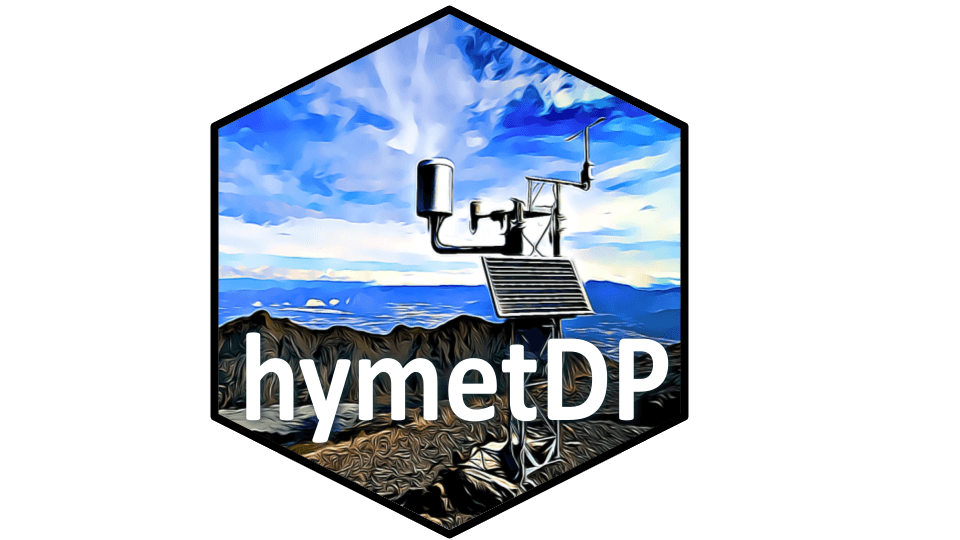

<!-- README.md is generated from README.Rmd. Please edit that file -->

```{r, include = FALSE}
knitr::opts_chunk$set(
  collapse = TRUE,
  comment = "#>",
  fig.path = "man/figures/README-",
  out.width = "100%"
)
```

# hymetDP 

<!-- badges: start -->
<!-- badges: end -->
## Overview

Tools to create, use, and convert 'ecocomDP' datasets. 'ecocomDP' is a dataset design pattern for harmonizing ecological community surveys in a research question agnostic format, from source datasets published across multiple repositories, and with methods that keep the derived datasets up-to-date as the underlying sources change. Described in O'Brien et al. (2021), <https://doi.org/10.1016/j.ecoinf.2021.101374>.

## Installation

Get the latest development version:
```{r eval=FALSE}
# install.packages("remotes")
remotes::install_github("kzollove/hymetDP")
```

## Getting help

Use [GitHub Issues](https://github.com/kzollove/hymetDP/issues) for bug reporting, feature requests, and general questions/discussions. When filling bug reports, please include a minimal reproducible example.

## Contributing

Community contributions are welcome! Please reference our [contributing guidelines](https://github.com/kzollove/hymetDP/blob/master/CONTRIBUTING.md) for details.

-----

Please note that this project is released with a [Contributor Code of Conduct](https://github.com/kzollove/hymetDP/blob/master/CODE_OF_CONDUCT.md). By participating in this project you agree to abide by its terms.

